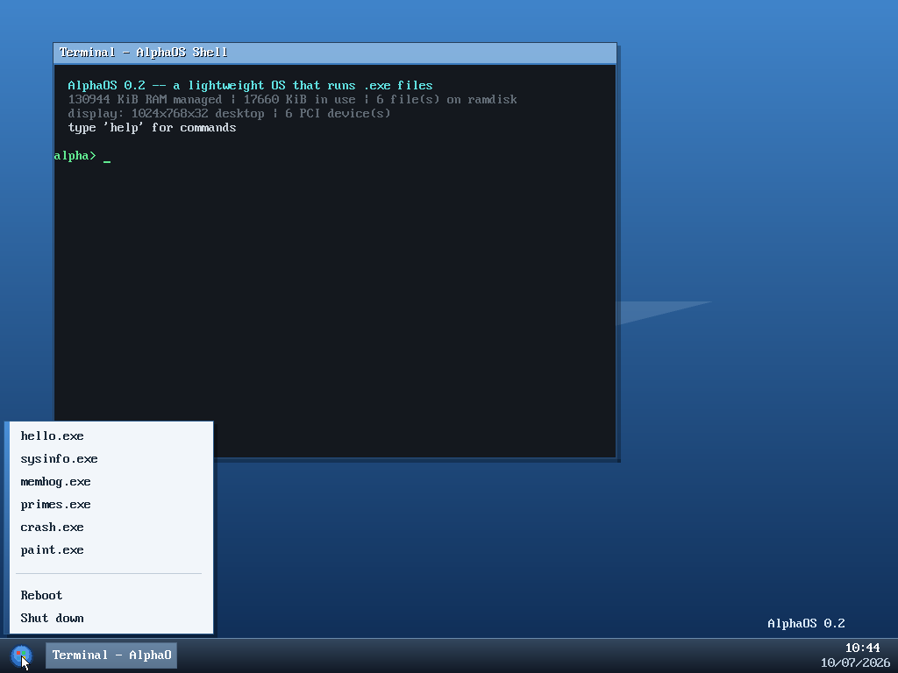
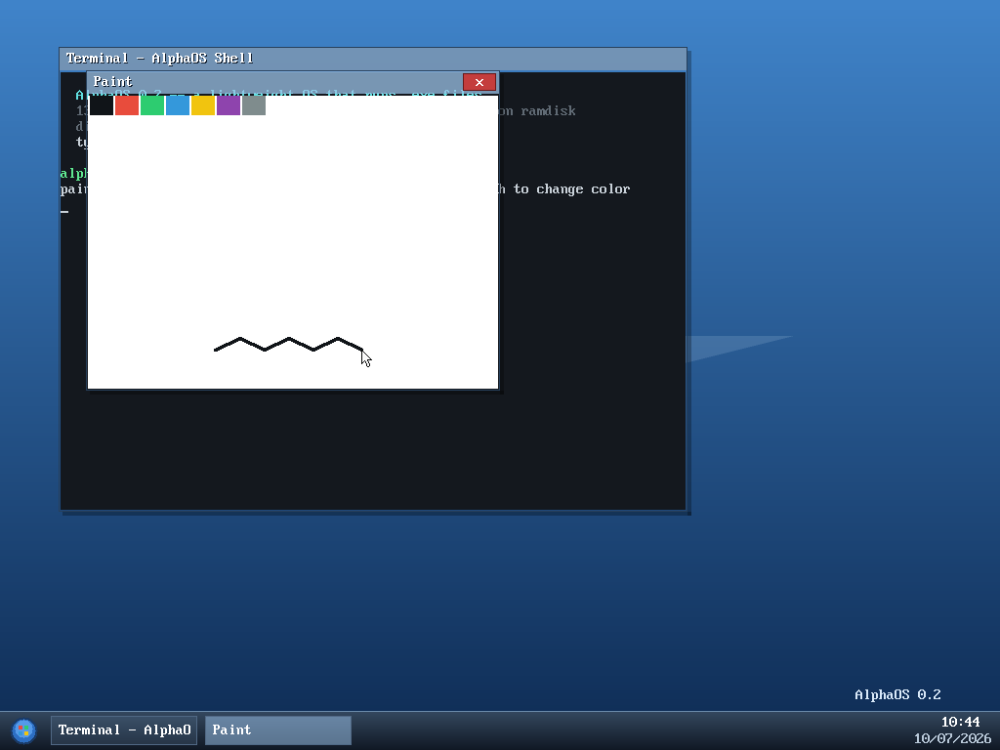
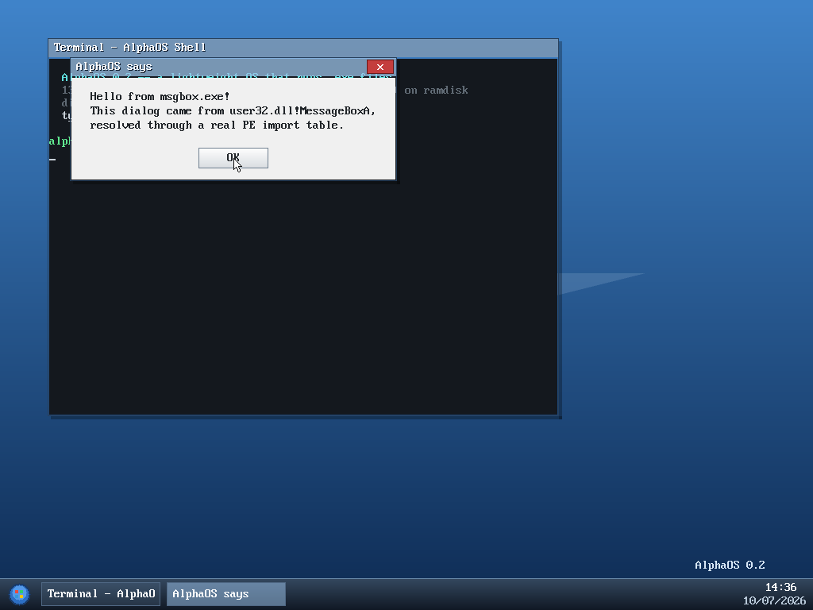

# AlphaOS

A lightweight **x86-64** operating system, written from scratch in C and
assembly, that **loads and runs `.exe` (PE32+) files the way 64-bit
Windows does** — resolving their DLL import tables against a built-in
Win32 API subset, using the real Microsoft x64 calling convention —
with a Windows-7-inspired graphical desktop and a real driver layer,
while staying tiny and careful about resources.

```
  AlphaOS 0.5 -- a lightweight OS that runs .exe files
  130944 KiB RAM managed | 17996 KiB in use | 9 file(s) on ramdisk
  display: 1024x768x32 desktop | 6 PCI device(s)

alpha> run mingw_hello.exe
hello from a REAL mingw-w64 compiled Windows binary
[os] reclaimed 24 bytes the process left allocated
[os] mingw_hello.exe exited with code 0 (10 ms)
```

That's not one of AlphaOS's own apps — it's `compat/mingw_hello.c`,
compiled by an **unmodified `x86_64-w64-mingw32-gcc`**, default flags,
full CRT startup (TLS, critical sections, argc/argv, atexit), no special
entry point. It just runs.


*The desktop: terminal window running the shell, start menu, taskbar
with live RTC clock — all running natively in x86-64 long mode.*


*`paint.exe` — a PE32+ executable that opens its own window through
the AlphaOS windowing API.*


*`msgbox.exe` — a Windows-style program calling
`user32.dll!MessageBoxA` through its PE import table.*

## Highlights

- **True x86-64** — boots via a temporary identity-mapped long-mode
  transition (`boot.S`), then `kernel/paging.c` builds a real 4-level
  page table (PML4 → PDPT → PD → PT) from PMM-allocated frames. 64-bit
  GDT/IDT, a hand-written interrupt-stub register save (x86-64 has no
  `pusha`), and `-mno-red-zone -mgeneral-regs-only` codegen throughout
  (interrupts run on the same stack as whatever they preempted, and
  the kernel never enables/manages SSE state, so both matter for
  correctness, not just style).
- **Real PE32+ loader** — validates the full header chain (DOS `MZ` →
  PE signature → COFF → PE32+ optional header → section table), checks
  `IMAGE_FILE_MACHINE_AMD64`, maps the image at its preferred
  `ImageBase` via paging, copies sections, zero-fills the `.bss` tail,
  and applies base relocations (`IMAGE_REL_BASED_DIR64`). The `.exe`
  files it runs are structurally valid PE files — `file` reports
  `PE32+ executable (console) x86-64, for MS Windows`, and
  `objdump -p` parses their import tables. Verified against a genuine,
  unmodified Microsoft-toolchain PE32+ binary (a real 64-bit Windows
  DLL pulled from PyPI): the loader correctly parses its real
  `ImageBase` (`0x180000000` — above 4 GiB, which is exactly why every
  address in this codebase is a 64-bit `uptr`, not `u32`) and its full
  import table, then fails cleanly on the first genuinely-missing
  import (`python311.dll!_PyUnicode_Ready`) rather than crashing.
- **Native-Windows-style API, real x64 ABI** — programs import OS
  functions by name from `kernel32.dll` / `user32.dll` through a
  genuine PE **import table** (8-byte `IMAGE_THUNK_DATA64` entries);
  the loader patches their IAT exactly like Windows' loader does.
  Every exported function uses GCC's `ms_abi` attribute — the actual
  Microsoft x64 calling convention (first args in RCX/RDX/R8/R9, 32
  bytes of caller-allocated shadow space, callee doesn't clean the
  stack) — so a real Windows toolchain binary built against this
  subset would call in correctly. Implemented subset: `ExitProcess`,
  `GetStdHandle`, `WriteConsoleA`, `WriteFile`, `ReadConsoleA`,
  `Sleep`, `GetTickCount`, `VirtualAlloc`/`VirtualFree`,
  `GetProcessHeap`, `HeapAlloc`/`HeapFree`, `GetCommandLineA`,
  `GetLastError`/`SetLastError`, `LoadLibraryA`, `GetProcAddress`,
  `lstrlenA`, and `user32.dll!MessageBoxA` — which draws a real modal
  dialog with an OK button. Unresolved imports fail the load with the
  missing `dll!symbol` named. Legacy AlphaOS-API programs (no imports)
  still run; the loader picks the convention per binary.
- **Enough of a CRT to run real third-party binaries, not just our
  own** — a `msvcrt.dll` module (`__getmainargs`, `__iob_func`,
  `_initterm`, `_onexit`/`_cexit`, `malloc`/`calloc`/`free`,
  `fprintf`/`vfprintf`/`fwrite`, `strlen`/`strncmp`/`memcpy`, ...)
  plus the rest of default-toolchain CRT startup's kernel32 needs
  (critical sections — safe no-ops, since AlphaOS never runs two
  processes at once; a small TLS slot table; `VirtualProtect`/
  `VirtualQuery`) and a **minimal TEB/PEB** so the `gs:0x30`
  (`NtCurrentTeb()`) idiom every CRT startup checks doesn't fault on
  a segment base that was never set up. `malloc`/`HeapAlloc`/
  `VirtualAlloc` all route through the same per-process tracker as
  everything else, so a CRT-heavy program that leaks still gets fully
  reclaimed. Proven against `compat/mingw_hello.c` (see above) — a
  completely ordinary, default-flags mingw-w64 build, not a specially
  minimized one.
- **GUI desktop (Windows-7 style)** — gradient wallpaper, overlapping
  draggable windows with alpha-blended "glass" title bars and drop
  shadows, a taskbar with a start orb, per-window buttons and a live RTC
  clock, and a start menu listing every `.exe` on the ramdisk. The shell
  runs inside a Terminal window; `.exe` apps can open windows of their
  own through the API (see `paint.exe`). Event-driven compositing: the
  CPU still idles in `hlt`, nothing redraws unless something changed.
- **Driver layer** —
  | driver | hardware | notes |
  |---|---|---|
  | `pci.c` | PCI bus (ports 0xCF8/0xCFC) | enumeration, `lspci`, drivers bind by ID |
  | `bga.c` | Bochs/QEMU VBE display | binds to PCI 1234:1111, 1024×768×32 LFB |
  | `mouse.c` | PS/2 mouse (IRQ 12) | 3-byte packets, ring buffer |
  | `keyboard.c` | PS/2 keyboard (IRQ 1) | scan set 1, shift/caps |
  | `rtc.c` | CMOS real-time clock | taskbar clock, `date` |
  | `pit.c` | 8254 timer (IRQ 0) | 100 Hz tick, sleep, uptime |
  | `serial.c` | 16550 UART | full headless console + logs |
  | `font.c` | VGA | captures the BIOS 8×16 font for the GUI |

  Balanced by design: if the display adapter is missing (e.g. unusual
  real hardware), the OS degrades gracefully to the VGA text-mode shell —
  every feature except windows still works.
- **Lightweight** — kernel ~3.8k lines of C/asm; the whole system boots
  to a composited desktop in well under a second.
- **Resource management**
  - Bitmap physical-memory manager + kernel heap with coalescing.
  - Every process allocation is tracked and reclaimed on exit **or
    crash** — including windows an app leaves open (`memhog.exe`,
    `paint.exe`), and Win32-style `VirtualAlloc`/`HeapAlloc` calls,
    which feed the same per-process tracker.
  - `mem`, `sysinfo.exe`, and the `meminfo` API expose live statistics.
- **Fault isolation** — CPU exceptions inside an app kill the process,
  not the OS (`crash.exe` demos a null dereference; page 0 is unmapped
  so null pointers actually fault). This is the property a real
  security audit pass hardened end-to-end — see
  [`SECURITY.md`](SECURITY.md) for what was found (several ways a
  malformed `.exe` could previously panic the whole kernel instead of
  just failing to load) and fixed, with working exploit-style test
  files proving the fixes hold.
- **AI assistant, safely split across the trust boundary** — an `ai
  <question>` shell command backed by the real Claude API. AlphaOS has
  no network/TLS stack (and won't grow one here — that's its own
  project), so `kernel/ai.c` talks a tiny allowlisted protocol over a
  second serial port to `tools/ai_bridge.py`, a host process that holds
  the actual API key. The guest-side handler is a closed five-way
  switch (`list_files`, `read_pe_info`, `mem_stats`, `pci_list`,
  `run_exe`) — there is no write/delete/shutdown opcode anywhere in the
  protocol, structurally, not just by prompt. `run_exe` (the one tool
  with a real effect) is off by default on the bridge and, even when
  enabled, requires a human to confirm each call interactively before
  it's forwarded. See `kernel/ai.c`'s header comment for the full
  threat model, and `tools/ai_bridge.py --mock` to exercise the whole
  guest↔host protocol with no API key and no network call at all.

## Building and running

Requirements: `gcc` (with x86-64 support — the default on most Linux
distros), `binutils`, `make`, `python3`, `qemu-system-x86_64`,
`grub-mkrescue` + `xorriso` (to build the bootable ISO — see below for
why). Optional: `x86_64-w64-mingw32-gcc` (mingw-w64) to build and
regression-test the real third-party compat binary — skipped cleanly
if absent. No cross-compiler needed for AlphaOS itself.

```sh
make          # build kernel, .exe apps, and a bootable GRUB ISO
make run-vga  # boot the desktop in a QEMU window  <-- the fun one
make run      # headless: serial console in your terminal (Ctrl-A X quits)
make test     # scripted end-to-end boot test (37 assertions)
make run-ai   # boot with the AI assistant's serial channel exposed;
              # pair with `ANTHROPIC_API_KEY=... python3 tools/ai_bridge.py`
              # (or --mock to try it with no API key at all)
```

In the GUI: click the orb for the start menu, launch `paint.exe`, drag
windows by their title bars, close them with the ✕. The Terminal window
is the same shell as the serial console — both are live at once.

**Why a GRUB ISO instead of `qemu -kernel` directly?** QEMU's own
built-in Multiboot loader only accepts 32-bit ELF kernels. AlphaOS is a
genuine 64-bit ELF, and GRUB2's Multiboot loader — unlike QEMU's — loads
a 64-bit ELF via a plain Multiboot 1 header without issue (the CPU
still starts in 32-bit protected mode either way; only QEMU's built-in
loader is picky about the ELF class). `make` builds `build/alphaos.iso`
via `grub-mkrescue`; `make run`/`run-vga`/`test` boot it with `-cdrom`.

## Shell commands

| command | description |
|---|---|
| `ls` | list files on the ramdisk |
| `run <file.exe>` | load and execute a PE executable (bare `name.exe` works too) |
| `peinfo <file>` | dump PE headers of an executable |
| `mem` | physical memory and heap statistics |
| `lspci` | list devices found by the PCI driver |
| `date` | read the real-time clock |
| `uptime`, `echo`, `clear`, `help`, `halt` | the usual |

## Bundled programs

| app | demonstrates |
|---|---|
| `hello.exe` | basic output, API versioning |
| `sysinfo.exe` | memory/uptime introspection |
| `primes.exe` | CPU work + heap allocation (sieve of Eratosthenes) |
| `memhog.exe` | leak reclamation: frees half its buffers, OS reclaims the rest |
| `crash.exe` | fault isolation: null deref kills the app, not the OS |
| `paint.exe` | **GUI app**: opens its own window, mouse drawing, palette |
| `winhello.exe` | **Windows-style**: kernel32 imports only — console I/O, VirtualAlloc/HeapAlloc, GetProcAddress, ExitProcess |
| `msgbox.exe` | **Windows-style**: `user32.dll!MessageBoxA` modal dialog |
| `compat/mingw_hello.c` → `mingw_hello.exe` | **real third-party binary**: unmodified default `x86_64-w64-mingw32-gcc` output, full CRT — built only if mingw-w64 is installed |

## How a `.exe` is born and executed

```
apps/foo.c ──gcc -m64──▶ foo.o ──ld -m elf_x86_64 (base 0x40001000)──▶ foo.elf
   ──objcopy -O binary──▶ foo.bin ──tools/mkpe.py──▶ foo.exe   (real PE32+)
   ──tools/mkinitrd.py──▶ initrd.img ──multiboot module──▶ ramdisk
```

Windows-style apps additionally link IAT slots + trampolines generated
by `tools/mkimports.py` from `apps/win32/imports.list` (8-byte
`IMAGE_THUNK_DATA64` slots, RIP-relative `jmp` trampolines), and
`mkpe.py` emits the matching PE32+ import directory (descriptors,
lookup tables, hint/name entries).

At `run foo.exe [args]` time the kernel:

1. parses and validates the PE headers and section table, rejecting
   anything that isn't `IMAGE_FILE_MACHINE_AMD64` PE32+,
2. allocates physical frames and maps them at the PE's `ImageBase`
   via the 4-level page table (identity-mapped kernel RAM sits well
   below any sane `ImageBase`, so the preferred base is always
   honored — even a real Windows DLL's default `0x180000000`),
3. copies each section to its `VirtualAddress`, zero-fills `.bss`,
   applies `.reloc` fixups if the base ever had to change,
4. **resolves the import table**: every `dll!name` the image imports is
   looked up in the kernel's kernel32/user32 export tables and written
   into the image's 64-bit IAT — the same job Windows' loader performs,
5. calls the entry point. Binaries with imports get the Windows
   convention (no arguments, `ms_abi` throughout — the OS is reached
   purely through imports); import-free binaries get the legacy
   AlphaOS convention (`int app_main(const alpha_api_t *os)`, System V
   ABI, which also carries the windowing API used by `paint.exe`),
6. on exit or crash: frees tracked heap allocations (`VirtualAlloc`,
   `HeapAlloc`, and AlphaOS `alloc` all feed the same per-process
   tracker), closes leftover windows, unmaps and frees the image pages,
   and reports anything it had to reclaim.

Apps run in ring 0 in a dedicated address range — a deliberate
lightweight design (no TSS/ring-3 machinery); protection comes from
paging, validation, and exception recovery rather than privilege levels.

Scope note: AlphaOS implements the Win32 *mechanism* (PE32+ imports,
the real Microsoft x64 ABI, IAT patching) and a useful API subset. A
program written against this subset — even built with a real Windows
toolchain (MinGW `-nostdlib`, no CRT) — runs unmodified, calling
convention and all. Arbitrary off-the-shelf Windows software still
won't: that needs the full Win32 surface and a CRT (a Wine-sized
project). Unsupported imports are reported by name at load time — see
`peinfo` on a real Windows binary for a demonstration of exactly how
far the loader gets before it needs something AlphaOS doesn't provide.

## Layout

```
kernel/   boot.S (long-mode transition), GDT/IDT (64-bit), drivers
          (pci, bga, mouse, kbd, rtc, serial, font), pmm, paging
          (4-level), kheap, ramdisk, PE32+ loader + import resolver,
          Win32/msvcrt API (win32.c, ms_abi), ai.c (AI channel),
          AlphaOS API, gfx primitives, window manager/compositor,
          terminal, shell
apps/     crt0.S, app.ld, alpha.h, sample programs; win32/ has the
          Windows-style runtime (win32.h, wincrt0.S, imports.list)
compat/   mingw_hello.c — built by a real mingw-w64 cross compiler,
          not AlphaOS's own toolchain, to regression-test genuine
          third-party Win32 binary compatibility
boot/     grub.cfg for the bootable ISO
tools/    mkpe.py (flat binary → PE32+ w/ import tables), mkimports.py,
          mkinitrd.py, run_tests.sh, ai_bridge.py (host half of `ai`)
include/  alpha_api.h — the kernel↔app ABI, shared by both sides
SECURITY.md — audit findings, fixes, and honestly-disclosed limitations
```
